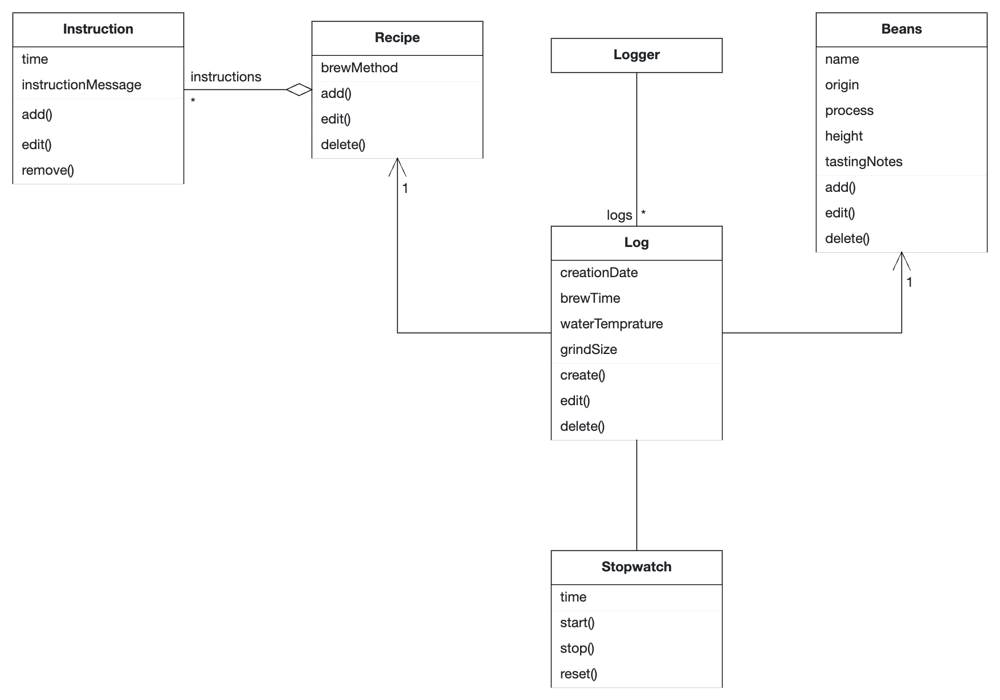

# Introcourse Project App for the iPraktikum - Inosensius Alvian

To pass the introcourse, you need to create your own unique iOS app (based on SwiftUI).

There are no requirements regarding the functions of your app, so you can get creative.
However, we provide you with Non-Functional Requirements (NFR) that your app needs to fulfill.

After each day of learning new Swift and SwiftUI concepts, these NFRs may change, or new NFRs get added.

## Submission procedure

You get a **personal repository** on Bitbucket to work on your app.

Once you implemented a new feature into your app, you need to create a Pull Request (PR) to merge your changes from the feature branch into your main branch.

Your tutor will review your changes and either request changes or approves the PR. 

If your PR got approved, you also need to merge it!

### Deadline: **19.04.2023 12:00**
Until the deadline all of your PRs **need to be merged** and your final app **needs to fulfill** all of the requested NFRs!

---

## Problem Statement (max. 500 words)

    As a coffee lover, I find it difficult to keep track of my recipes and my settings. So rather than writting everything on post it notes and sticking them all over my room, 
I would love an app that can keep track of all my notes. 

The app itself should be able to keep track of recipes of different brewing methods that I use, Keep track of beans that I brew. I also need to be able to add specific details for each combination of recipe and beans, details such as, grind size, and temprature. The app should also have a built in stopwatch/timer and hints for each recipe steps.

I should also be able to filter beans or recipes by types, and also mark any recipes, beans, or the combination as favorites. Brews should also be logged and can be editted and deleted.

## Requirements

- Add recipe entries
    The user should be able to add recipe entries for specific brewing method with timing and description infos

- Add beans entries 
    Users should be able to add entries of beans with details such as: bean name, origin, process, height, and tasting notes.
    
- Combine recipe and beans
    Users should be able to combine any recipe with any beans available. And they should be able to add details such as: grind size, water temprature 
    
- Log brews of a specific combination of recipe and beans     
    The app should log everytime the user decides to brew. The data that is log are: creationdate, recipe, beans type, brew time, grind size
    
- Start stopwatch
    The user should be able to start a stopwatch to time the brews
    
- Filter recipe and beans
    user can filter recipes and beans based on typed
    
- Mark favorites 
    user can mark their favorite beans and recipes
    

## Analysis

## System Design

TODO: Include a system design overview describing your application.

## Product Backlog
BREWIN 1 - Add recipes & beans
BREWIN 2 - View recipes & beans
BREWIN 3 - Edit recipes & beans
BREWIN 4 - Start and stop stopwatch
BREWIN 5 - Add grind size and temprature to a recipe and bean combination
BREWIN 6 - Start brewing and log them
BREWIN 7 - View and edit logs
BREWIN 7 - Filter recipes & beans
BREWIN 8 - Mark favorite recipes & beans
